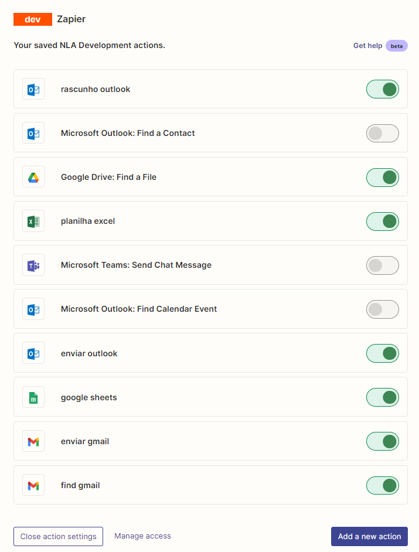

## GPT And LangChain Agents 

**GPT And LangChain Agents** é um projeto que demonstra o uso de agentes e ferramentas LangChain para interagir com a API do OpenAI, realizar pesquisas na web, manipular arquivos e muito mais. Este repositório contém código Python que cria agentes capazes de responder a consultas, executar ações e interagir com os usuários.

## Licença

Este projeto é licenciado sob a licença MIT. A Licença MIT é uma licença de código aberto que permite que você use, modifique e distribua o código livremente, desde que inclua um aviso de direitos autorais e a licença original.

## Como Usar

Siga as etapas abaixo para começar a usar o ChatGPTLangChain em seu ambiente:

1. **Configuração da Chave da API**: Antes de executar o código, é necessário configurar a chave da API do OpenAI e outras chaves de API necessárias no arquivo `apikey.py`. Este arquivo contém as chaves de autenticação necessárias para acessar os serviços da API do OpenAI.

2. **Configuração de Tools**

    Base de Dados**: O projeto inclui um exemplo de uso de uma base de dados SQLite chamada `chinook.db`. Certifique-se de que a base de dados esteja no mesmo diretório do código ou ajuste o caminho no código, se necessário. A base de dados é usada para fins de demonstração e teste.

    Configuração Zapier NLA: 
    

3. **Seleção do Tipo de Agente**: Escolha o tipo de agente desejado ajustando a variável `Agent_type` no código. Há diferentes tipos de agentes disponíveis, cada um com suas próprias características e funcionalidades. Os tipos de agentes incluem:
   - `CHAT_CONVERSATIONAL_REACT_DESCRIPTION`: Um agente que suporta conversações e pode reagir a descrições de tarefas.
   - `STRUCTURED_CHAT_ZERO_SHOT_REACT_DESCRIPTION`: Um agente estruturado que suporta conversações e pode reagir a descrições de tarefas.
   - `ZERO_SHOT_REACT_DESCRIPTION`: Um agente que não suporta conversações, mas pode reagir a descrições de tarefas. Zapier funciona com este agente, até onde foi testado neste projeto.

4. **Execução do Código**: Execute o código Python fornecido para interagir com o agente. Siga as instruções exibidas no terminal para digitar consultas e interagir com o agente. Experimente diferentes tipos de consultas para ver como o agente responde.

5. **Ferramentas e Integrações**: O projeto inclui várias ferramentas e integrações, como pesquisa na web, manipulação de arquivos e integração com o Zapier. Explore as funcionalidades e adapte o código conforme necessário para suas necessidades específicas.

## Documentação Adicional

Para obter informações detalhadas sobre como usar este projeto e suas funcionalidades, consulte a documentação dentro do próprio código-fonte. Os comentários explicativos no código fornecem informações adicionais sobre o funcionamento interno e a configuração.

## Contribuições

Contribuições são bem-vindas! Se você deseja melhorar ou expandir este projeto, sinta-se à vontade para abrir problemas (issues) ou enviar solicitações de recebimento (pull requests). Sua contribuição pode ajudar a tornar este projeto ainda mais útil para a comunidade.

## Autor

Este projeto é mantido por [PeriniDev](https://github.com/PeriniDev). Se você tiver alguma dúvida ou precisar de assistência, não hesite em entrar em contato.

Aproveite a exploração e experimentação com ChatGPTLangChain!